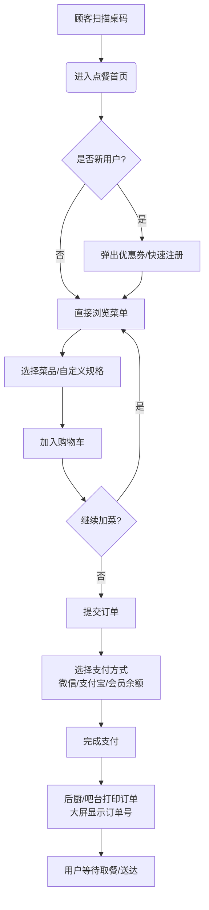
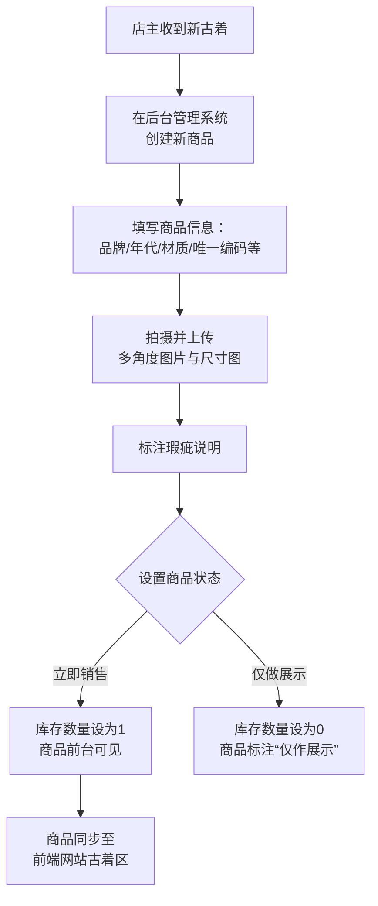

# 树莓咖啡屋线上平台 - 需求分析与设计文档

> **文档说明**：本文档详细描述了"树莓"咖啡屋线上平台的需求分析与设计方案，适用于产品、设计和开发团队参考。
> **项目阶段**：MVP (最小可行产品) 阶段
> **最后更新**：2024年1月

## 📋 项目概述

### 核心价值主张
在一个充满文艺复古艺术气息的空间里，发现独特古着并享受美食的治愈体验。

### 项目目标
- **短期**：提升到店顾客点餐效率，实现数据可视化管理
- **长期**：通过TikTok引流，拓展境外古着电商业务
- **技术**：基于Vue的独立H5网站，优先适配移动端

### 成功度量标准
- 收入数据日/月/年可视化分析
- 点餐流程简化，支付成功率>99%
- 支持多方式注册登录（微信、支付宝、手机号、邮箱）
- 会员充值系统提升用户粘性

---

## 👥 用户画像

### 本地顾客

| **用户类型** | **核心特征** | **使用场景** | **业务价值** |
|-------------|-------------|-------------|-------------|
| **小杨** 25岁女性白领 | 喜欢拍照、追求小众时尚、社交需求强 | 周末与朋友小聚，快速点餐并浏览古着区 | 高复购率，品牌口碑传播关键节点 |
| **小王** 15岁中学生 | 价格敏感、需要安静环境、高效体验 | 午休自习，快速下单用餐不希望被打扰 | 稳定日常客流，提升非高峰时段利用率 |
| **小陈小邱** 20岁情侣 | 喜欢拍照、时尚穿搭、注重环境氛围 | 约会拍照，享受复古环境与精致餐点 | 高客单价，社交媒体传播主力 |
| **家庭顾客** 45岁宝妈宝爸带子女 | 家庭聚餐需求、注重食品安全与环境 | 周末家庭晚餐，享受私厨定制服务 | 稳定周末客流，客单价较高 |

### 境外顾客

| **用户类型** | **核心特征** | **发现渠道** | **购买偏好** |
|-------------|-------------|-------------|-------------|
| **日本大学生Aki** | 热衷80年代美国复古穿搭、注重商品细节 | TikTok、Instagram | 信任品牌、年代、尺寸和瑕疵说明 |
| **中亚女生** | 喜欢中古服饰穿搭、寻求独特风格 | TikTok、Amazon | 关注材质、做工和独特性 |
| **北美女生** | 喜欢可爱宠物饰品、容易被视觉吸引 | TikTok | 冲动消费，注重商品视觉效果 |
| **东南亚女生** | 喜欢潮流修身复古风、价格敏感 | TikTok | 关注性价比和物流成本 |

---

## 🔄 核心业务流程

### 到店扫码点餐流程

**关键特性说明：**
- 支付页面保留30分钟，用户可随时取消或完成支付
- 支持菜品自定义（糖度、奶型、酱汁等）
- 实时订单状态追踪

### 后台商品入库与上架流程

**关键特性说明：**
- 古着商品唯一编码管理
- 库存实时同步（线上售出即下架）
- 支持"仅展示"状态，用于宣传

---

## 🏗️ 系统功能架构

### 前台用户端功能

#### 用户体系 (MVP核心)
- ✅ 注册/登录（手机号、邮箱、微信、支付宝）
- ✅ 会员中心
  - ✅ 会员充值 (MVP核心)
  - 🔄 积分系统 (二期)
  - ✅ 我的优惠券
- ✅ 消息通知（站内信）

#### 点餐模块 (MVP核心)
- ✅ 菜单浏览（支持分类）
- ✅ 菜品详情（支持自定义规格）
- ✅ 购物车
- ✅ 下单与支付 (MVP核心)
- ✅ 订单状态追踪
- 🔄 预约订座 (二期)

#### 电商模块 (二期)
- 🔄 商品列表与筛选
- 🔄 商品详情（多图、尺码、瑕疵）
- 🔄 购物车与结算
- 🔄 物流查询

#### 营销与内容
- ✅ 新用户弹窗与优惠
- ✅ 轮播图
- ✅ 新品推荐
- 🔄 在线客服 (二期)

### 后台管理系统 (MVP核心)

#### 仪表盘 (MVP核心)
- ✅ 收入数据可视化（日/月/年，占比）

#### 点餐管理 (MVP核心)
- ✅ 菜单管理（增删改查、动态调整）
- ✅ 订单管理
- ✅ 桌台管理（为预约功能做准备）

#### 商品管理 (MVP核心)
- ✅ 古着/饰品管理（增删改查、库存设置）
- ✅ 商品分类

#### 用户与营销管理
- ✅ 用户列表
- ✅ 优惠券管理
- 🔄 会员与积分设置 (二期)

#### 内容管理
- ✅ 轮播图管理 (MVP核心)

---

## 🗃️ 数据库设计

### 核心实体关系

#### 用户表 (Users)
| 字段名 | 类型 | 说明 | 约束 |
|--------|------|------|------|
| user_id | BIGINT | 用户ID | 主键，自增 |
| login_method | VARCHAR(20) | 登录方式 | 微信/支付宝/手机/邮箱 |
| membership_balance | DECIMAL(10,2) | 会员余额 | 默认0.00 |
| points | INT | 积分 | 默认0 |
| created_at | TIMESTAMP | 创建时间 | 默认当前时间 |

#### 商品表 (Products)
| 字段名 | 类型 | 说明 | 约束 |
|--------|------|------|------|
| product_id | BIGINT | 商品ID | 主键，自增 |
| product_name | VARCHAR(100) | 商品名称 | 非空 |
| product_type | VARCHAR(20) | 商品类型 | 餐饮/古着/饰品 |
| price | DECIMAL(10,2) | 价格 | 非空 |
| stock | INT | 库存 | 古着通常为1，餐饮可为999 |
| status | VARCHAR(20) | 状态 | 上架/下架/仅展示 |
| product_details | JSON | 商品详情 | 存储品牌、年代、材质、瑕疵等 |
| images | JSON | 图片集 | 存储图片URL数组 |

#### 订单主表 (Orders)
| 字段名 | 类型 | 说明 | 约束 |
|--------|------|------|------|
| order_id | BIGINT | 订单ID | 主键，自增 |
| user_id | BIGINT | 用户ID | 外键，关联Users |
| order_type | VARCHAR(20) | 订单类型 | 堂食/外卖/电商 |
| total_amount | DECIMAL(10,2) | 订单金额 | 非空 |
| order_status | VARCHAR(20) | 订单状态 | 待支付/已支付/制作中/已完成 |
| pickup_number | VARCHAR(50) | 取餐号/物流单号 | 可为空 |
| created_at | TIMESTAMP | 创建时间 | 默认当前时间 |

#### 订单明细表 (Order_Items)
| 字段名 | 类型 | 说明 | 约束 |
|--------|------|------|------|
| item_id | BIGINT | 明细ID | 主键，自增 |
| order_id | BIGINT | 订单ID | 外键，关联Orders |
| product_id | BIGINT | 商品ID | 外键，关联Products |
| quantity | INT | 购买数量 | 默认1 |
| unit_price | DECIMAL(10,2) | 成交单价 | 非空 |
| customization | JSON | 规格选择 | 存储口味、糖度等自定义信息 |

---

## 🎨 设计规范

### 视觉风格
- **主题灵感**：宫崎骏动画治愈风格
- **主色调**：天蓝 (#87CEEB)、海蓝 (#0077BE)、阳光黄 (#FFD700)、青草绿 (#7CFC00)
- **辅助色**：柔和米色 (#F5F5DC)、深蓝色 (#003366)
- **图标**：统一风格线性图标，禁止使用emoji

### 交互设计原则
- 移动端优先，大图展示商品
- 页面布局简洁，留白充足
- 交互动效自然流畅（淡入淡出、滑动）
- 手势支持：滑动轮播图，下拉刷新

---

## 📅 项目里程碑

### MVP阶段 (8-10周)
| 阶段 | 时间 | 主要交付物 | 状态 |
|------|------|------------|------|
| 需求与设计 | 2周 | 详细需求文档、UI设计稿 | 🔄 进行中 |
| 核心框架 | 2周 | 开发环境、基础组件、路由架构 | ⏳ 待开始 |
| 用户与点餐 | 3周 | 注册登录、菜单、购物车、支付 | ⏳ 待开始 |
| 后台管理 | 2周 | 仪表盘、商品管理、订单管理 | ⏳ 待开始 |
| 测试上线 | 1周 | 功能测试、部署上线 | ⏳ 待开始 |

### 二期规划
- 电商全功能开发（4-5周）
- 预约订座系统（2周）
- 会员积分与营销工具（3周）
- 多语言与境外支付优化（2周）

---

## ⚠️ 风险与约束

### 技术约束
- 必须支持移动端浏览器
- 基于Vue.js的H5技术栈
- 支付接口需支持微信、支付宝、银行卡、PayPal、Stripe

### 业务约束
- 符合餐饮行业规范
- 境外物流与关税由客户承担
- 3个月内完成MVP上线

### 风险评估
| 风险 | 可能性 | 影响 | 应对措施 |
|------|--------|------|----------|
| 支付接口集成复杂 | 中 | 高 | 预留开发时间，准备备用方案 |
| 境外物流成本高 | 高 | 中 | 前期物流调研，设置合理运费策略 |
| 需求范围蔓延 | 中 | 高 | 严格需求冻结，分阶段交付 |

---

## 📞 联系方式

**项目负责人**：[您的姓名]
**业务方**：树莓咖啡屋店主
**文档版本**：v1.0
**最后评审日期**：[日期]

---
*本文档将随项目进展持续更新，请关注版本号变化。*

您可以将此Markdown内容直接复制到Notion页面中，Notion会自动识别Markdown格式并正确显示所有表格、列表和标题结构。如需进一步调整格式，Notion提供了丰富的块操作功能。
